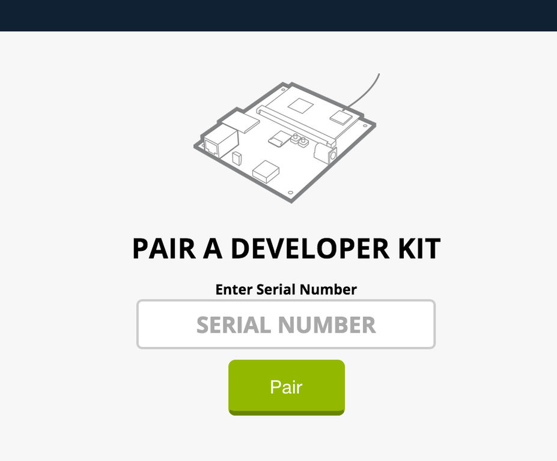

# TESTING

The aim of this document is to provide a basic test plan which asserts the main hardware functions of the device work under Ubuntu snappy.

In summary the functions we will be testing are:

* Restoring a factory image which contains Ubuntu snappy
* Connecting the sphere to a wireless network
* Pair the sphere to Ninja Blocks cloud service
* Pair a Zigbee Power Socket
* Check that gestures are working
* Check the LED matrix is working

# SETUP

Ninja blocks provides a firmware archive which needs to be downloaded and installed on a factory sphere.

See flashing document.

# TEST PLAN

## Connecting to a Network

Once the sphere is imaged it is ready to be configured.

* Plug in the mini USB cable to the sphere and connect this to a laptop. To access the device you can either use screen or putty. One thing to note is the screen command below is using the device as detected on my OSX laptop, this will be different on Linux platforms.

```
screen /dev/tty.usbmodem1411 115200
```

* Login to the device using the standard snappy user name and password of ubuntu in lower case.

* Use sudo to login as root.

```
sudo -i
```

* Use `wpa_cli` to configure the wireless interface.

```
root@localhost:~# wpa_cli
wpa_cli v2.1
Copyright (c) 2004-2014, Jouni Malinen <j@w1.fi> and contributors

This software may be distributed under the terms of the BSD license.
See README for more details.


Selected interface 'wlan0'

Interactive mode

> add_network 0
0
> set_network 0 ssid "homenet"
OK
> set_network 0 psk "XXX"
OK
> enable_network 0
OK
...
> save
OK
```

* Note down the the serial number, this will need to be entered to pair and the device, one thing to note this is case sensitive.

```
echo $(sphere-serial)
```

* Reboot the device.

```
reboot
```

## Logging in using SSH

* Just to verify network is working you can ssh into the device, where `x.x.x.x` is the IP address assigned to your ninja sphere or `webdm.local`.

```
ssh ubuntu@x.x.x.x
```

## Testing the Zigbee Stack

The software which drives the zigbee chip is provided by Texas Instruments, we are going to run through using this to connect and control a Zigbee power socket.

TODO John

## Pairing to Ninja Blocks Cloud

* Once your able to connect with screen/putty again the device is ready to pair. Sign up for an account at [Sphere Identity site](https://id.sphere.ninja/) then navigate to [API Site](https://api.sphere.ninja) which should once loaded look like the image below.


* Once you have entered the serial and hit the Pair button the device should wake up and show a clock on the top.

## Setting up your Sphere Site

This section will be run from an Ubuntu machine on your network. It will require the following packages:
```
apt-get install -y jq curl
```

Next, we will set a shell variable containing the IP address of your Sphere on the network (the same as used to SSH above):
```
sphere_ip=x.x.x.x
```

For convenience, use the following to grab the site ID of your sphere, this should print a UUID:
```
site_id=$(curl -s http://$sphere_ip:8000/rest/v1/sites | jq -r '.data[0].id'); echo $site_id
```

Now update your site to have a latitude/longitude of your chosing, in this example we're using a place in Taipei, Taiwan. Note that it must be a valid lat/long that has an associated city:
```
curl -X PUT -H "Content-Type: application/json" -d '{"id":"'$site_id'","name":"Home","type":"home","longitude":121.6333,"latitude":25.0333}' http://$sphere_ip:8000/rest/v1/sites/$site_id
```

## Setting up a LIFX

...

# COMPLETION

At the end of this process you should have a ninja sphere running snappy that is connected and paired to the ninja blocks cloud service over wireless. The device should respond to gestures, this will wake up the display and show the clock.

# KNOWN ISSUES

While porting the ninja sphere to snappy we encountered some issues, work arounds have been created for most but there are still some rather pointy ones.

* Initial boot up takes 360 seconds when there is no network access, this is attributed to the way networking is configured in the current release of snappy, we have raised this with the Ubuntu team.

* App Armor profiles are problematic while upgrading snaps, we have observed cases were changes to the profiles aren't propegated and we need to force a reload using the aa-* commands. This shouldn't affect testing, unless updates are pulled down.

* Bluetooth, although this is a feature of our ninja sphere we are unable to demonstrate it at this stage due to the complexity in packaging bluez in a snap package. We are hoping to work with Ubuntu to come up with a nice solution for this.
